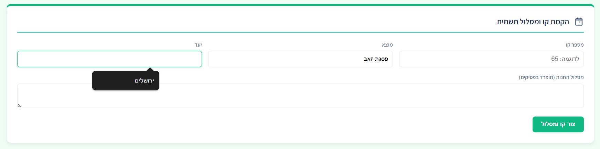
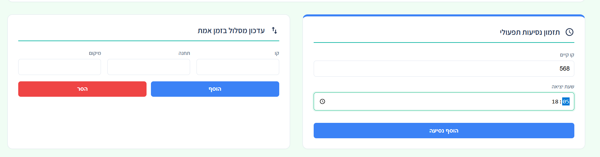

# 🚌 EasyRide | ניהול קווי תחבורה חכם

פרויקט **Full-stack** המציע פתרון מקצה לקצה לניהול קווי אוטובוס ונסיעות. המערכת מבוססת על ארכיטקטורת **Spring Boot 3-Layer** ומציגה ממשק משתמש מתקדם ומודרני.

---

## 📸 System Overview (מבט על המערכת)

### ניהול תשתית וקווים (Infrastructure Management)
באמצעות פאנל זה ניתן להקים קווים חדשים ולהגדיר את מסלול התחנות. המערכת תומכת ב-Autocomplete לשיפור חווית המשתמש.

### תפעול ועדכון בזמן אמת (Operational Control)
ניהול לוחות זמנים ועדכון דינמי של מסלולי הנסיעה (הוספה/הסרה של תחנות) בלחיצת כפתור.

---

## ✨ Key Features (תכונות עיקריות)

* **Dynamic Routing:** ניהול מסלולים גמיש המאפשר הוספה והסרה של תחנות תוך עדכון אוטומטי של סדר התחנות בקו.
* **Passenger Services (Kal-Kav):** חישוב זמני הגעה, הצגת מסלול נסיעה מלא ואיתור נסיעות אחרונות וקרובות.
* **Vivid ZEO UI:** ממשק Web מודרני ברוחב מלא, הכולל גלילה אוטומטית לפלט ותמיכה ב-Autocomplete מובנה.

## 🛠️ Tech Stack (טכנולוגיות)

* **Backend:** Java & Spring Boot (REST API).
* **Database:** **H2 Database (In-memory)** - לניהול נתונים מהיר בסביבת פיתוח.
* **Frontend:** HTML5, CSS3, JavaScript (Fetch API & Modern UI).

## 🚀 Getting Started (איך מריצים?)

1. בצעי **Clone** ל-Repository למחשב האישי.
2. הריצי את האפליקציה דרך ה-IDE (כמו IntelliJ או VS Code).
3. פתחי את הדפדפן בכתובת: `http://localhost:8080`.

---
**פותח על ידי א.שיף | Java Backend Developer Project**

---

# 🚌 EasyRide | Smart Transport Management

A comprehensive **Full-stack** solution for real-time management of bus lines and travels. Built with a robust **Spring Boot 3-Layer Architecture** (Model-Service-Repository), featuring a high-fidelity modern UI.

## 📸 System Overview

### Infrastructure Management
Easily establish new bus lines and define station routes. The system supports dynamic data entry with built-in browser autocomplete for enhanced UX.

### Operational Control & Real-time Updates
Manage schedules and dynamically update routes (add/remove stations) with a single click.

## ✨ Key Features

* **Dynamic Routing:** Flexible route management allowing real-time station modifications with automatic sequence re-ordering.
* **Passenger Services (Kal-Kav):** Arrival time calculations, full route visualization, and "Next Arrival" lookup.
* **Vivid ZEO UI:** A modern, full-width web dashboard featuring smart scrolling and native autocomplete support.

## 🛠️ Tech Stack

* **Backend:** Java & Spring Boot (REST API).
* **Database:** **H2 Database (In-memory)** - used for fast and efficient data persistence during development.
* **Frontend:** HTML5, CSS3, and JavaScript (Fetch API & Modern UI Design).

## 🚀 Getting Started

1. **Clone** the repository to your local machine.
2. Run the application through your IDE (IntelliJ, VS Code, etc.).
3. Open your browser at: `http://localhost:8080`.
4. **Note:** As the system uses H2, data is persisted for the duration of the server session.

---
**Developed by Elky schiff | Java Backend Developer Project**
